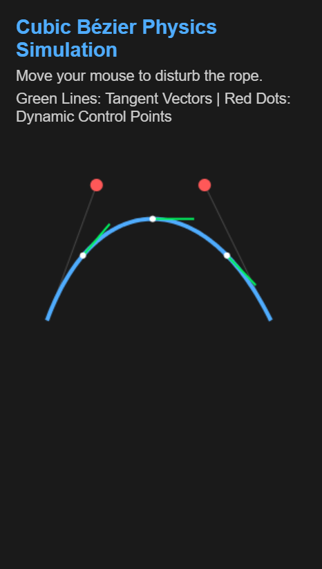

# 🧵 Interactive Bézier Rope Simulation

A mathematically driven, physics-inspired **interactive cubic Bézier curve** that behaves like a real elastic rope — fully implemented **from scratch** using **HTML5 Canvas and Vanilla JavaScript**.

No external physics engines.  
No spline libraries.  
Just **pure math, physics, and rendering**.

---

## 🌟 Project Overview

This project simulates a **cubic Bézier curve** that dynamically reacts to user input, producing a smooth, elastic *rope-like motion*.

The system demonstrates the intersection of:

- 📐 **Mathematical Modeling** — Cubic Bézier curves via Bernstein polynomials  
- 🧮 **Differential Geometry** — First-order derivatives for tangent visualization  
- ⚙️ **Physics Simulation** — Custom spring–damper system (Hooke’s Law)  
- 🎨 **Real-Time Rendering** — HTML5 Canvas animation loop  

All logic is implemented manually without libraries such as **D3.js**, **Three.js**, or **Matter.js**.

---

## 🖼️ Demo Preview

> Here is what it looks like 👇

---

## 🚀 Setup & Execution

No installation. No dependencies.

### ▶️ Run the Project
1. Locate `index.html`
2. Double-click to open it in any modern browser  
   *(Chrome, Firefox, Edge, Safari)*
3. Move your mouse — the Bézier rope will **swing, stretch, and settle** naturally

---

## 📐 Mathematical Model

### 1️⃣ Cubic Bézier Curve Definition

Instead of using the recursive **De Casteljau algorithm** (less efficient for real-time rendering), this project uses the **explicit Bernstein polynomial form**.

#### ✏️ Position Equation

For parameter \( t \in [0,1] \):

\[
\mathbf{B}(t) = (1 - t)^3 \mathbf{P}_0
+ 3(1 - t)^2 t \mathbf{P}_1
+ 3(1 - t)t^2 \mathbf{P}_2
+ t^3 \mathbf{P}_3
\]

- **\( \mathbf{P}_0, \mathbf{P}_3 \)** → Fixed anchor points (screen edges)  
- **\( \mathbf{P}_1, \mathbf{P}_2 \)** → Dynamic control points driven by physics  

🔁 The curve is rendered by sampling **100 points**  
(\( \Delta t = 0.01 \)) and connecting them using the Canvas API.

---

### 2️⃣ Tangent & Derivative Visualization

To visualize **direction and velocity** along the curve, the **first derivative** is computed manually.

#### ✏️ First Derivative

\[
\mathbf{B}'(t) =
3(1 - t)^2(\mathbf{P}_1 - \mathbf{P}_0)
+ 6(1 - t)t(\mathbf{P}_2 - \mathbf{P}_1)
+ 3t^2(\mathbf{P}_3 - \mathbf{P}_2)
\]

#### 🟢 Visualization Strategy
At selected points \( t = 0.2, 0.5, 0.8 \):

1. Compute derivative vector  
2. Normalize (unit length)  
3. Scale to **40px**  
4. Render as a **green tangent line**

This clearly illustrates **local curve direction and flow**.

---

## ⚙️ Physics Model (Spring–Damper System)

To achieve realistic rope motion, the control points are modeled as **masses attached to springs**.

### 🔩 Hooke’s Law with Damping

Each animation frame uses **Euler integration**:

#### 1️⃣ Force Calculation
\[
\mathbf{F} = -k(\mathbf{x} - \mathbf{x}_{target})
\]

- \( k = 0.05 \) → Rope stiffness  
- Target position is influenced by mouse movement  

#### 2️⃣ Velocity Update
\[
\mathbf{v} = \mathbf{v} + \mathbf{F}
\]

#### 3️⃣ Damping (Air Resistance)
\[
\mathbf{v} = 0.90 \times \mathbf{v}
\]

Prevents infinite oscillation and ensures smooth settling.

#### 4️⃣ Position Update
\[
\mathbf{x} = \mathbf{x} + \mathbf{v}
\]

---

### 🖱️ Mouse Interaction Mapping

The mouse acts as a **dynamic external force**:

- Distance from screen center creates offset
- Offset modifies target positions of \( \mathbf{P}_1 \) and \( \mathbf{P}_2 \)
- Results in fluid, natural motion resembling wind or pulling

---

## 🗂️ File Structure

### 📄 `index.html` contains:
- **Math Layer** → `Vec2` class & Bézier computations  
- **Physics Layer** → `PhysicsPoint` (velocity, damping, forces)  
- **Rendering Layer** → Canvas draw loop & tangent visualizers  

---

## 📚 References

- 📘 **Mathematics**  
  Mortenson, M. E. (1999). *Mathematics for Computer Graphics Applications*.  
  Industrial Press — Parametric Curves

- ⚙️ **Physics**  
  Symplectic Euler integration for damped harmonic oscillators

---

## 👩‍💻 Author

**Smriti Yadav**  
Bachelor’s in Information Technology  
Focus: Computer Graphics · Physics Simulation · Interactive Systems

---

⭐ *If you find this project interesting, feel free to star the repository!*
